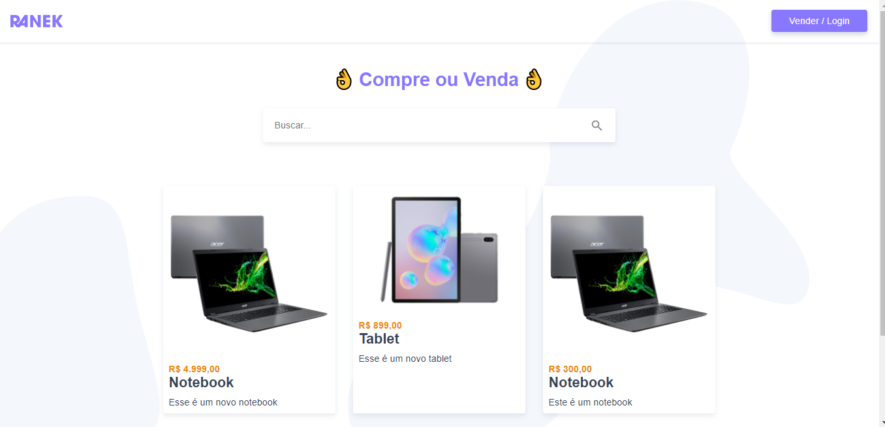
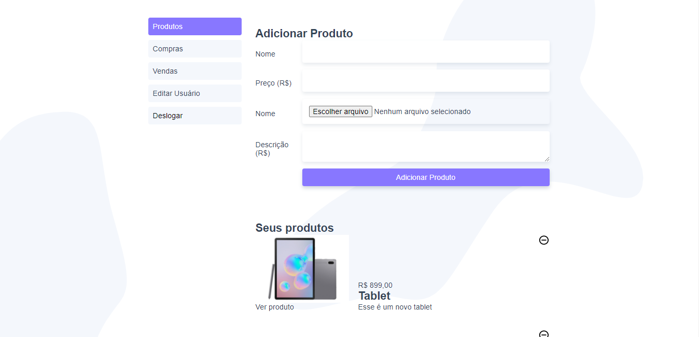

# Projeto ranek

## Instalaçao

```
npm install
```

### Rodar o projeto

```
npm run serve
```

# Projeto de loja virtual

### Tecnologias Utilizadas

- [VueJS] - Framework para construi a SPA!
- [VSCode] - Editor de código
- [VueX] - Gerenciamento de estado.
- [Vue Router] - Roteamento da aplicação
- [Axios] - Requisição HTTP.
- [JSON server] - Para construi a API fake.

;
;
